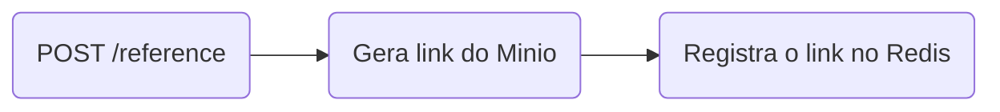
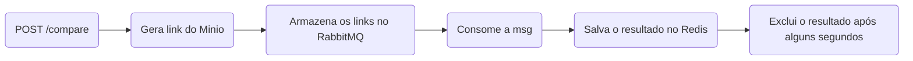

## Documentação

### Endpoints

#### GET /

Verifica se o serviço está funcionando. Retorna apenas o texto "EXECUTANDO!".

#### POST /reference

Recebe um arquivo de imagem como anexo, envia para o **Minio** e armazena sua URL no **Redis**, com o identificador especificado.

**Body params (multipart-form)**
identifier: *string*
file: *File*

**Returns**
id: *uuid*

#### POST /compare

Recebe um arquivo de imagem como anexo, envia para o **Minio**, baixa as duas imagens e as compara, respondendo com o valor da similaridade e oo resultado do *match*.

**Body params (multipart-form)**
identifier: *string*
file: *File*

#### GET /result/:id

Informa o id da comparação e recupera o objeto resultado, caso já esteja disponível, ou *null*, caso contrário.

**Route params**
id: *uuid*